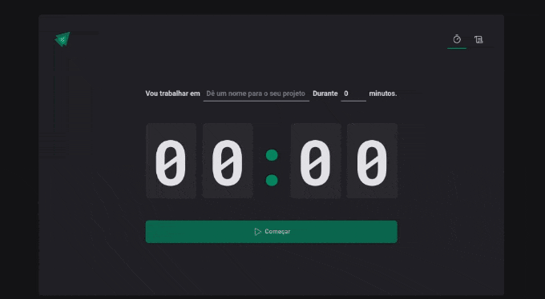

# React Pomodoro

Aplicação para quem deseja de foco nos seus projetos e estudos. 

## 🧑🏻‍💻 Tecnologia utilizada:

React: [https://pt-br.reactjs.org/](https://pt-br.reactjs.org/)
Vitejs: [https://vitejs.dev/](https://vitejs.dev/)
Styled-components: [https://styled-components.com/](https://styled-components.com/)
Zod: [https://github.com/colinhacks/zod](https://github.com/colinhacks/zod)
Phosphor-react: [https://phosphoricons.com/](https://phosphoricons.com/)
Immer: https://github.com/immerjs/immer
Date-fns: [https://date-fns.org/](https://date-fns.org/)

## 📺 Projeto:



## ⚒️Instalação:

Para instalação e visualização do projeto.

```jsx
npm install
```

```jsx
npm run dev
```

Feito com 💚